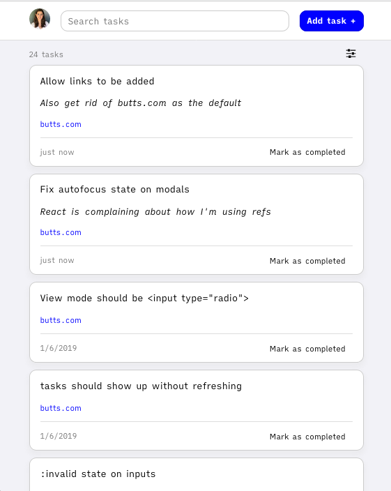

# Another one

A personal tasks manager for me and by me. Mostly an excuse to get a feel for [React Hooks](https://reactjs.org/docs/hooks-intro.html).

**Not accepting PRs**

This is a simple tasks manager I made for myself. Mostly functional! Not fully functional.

The tasks data store lives on a private service run by me. If you're not me (you're not), you won't be able to log in, but you can still try it out at [tasks.taravancil.com](https://tasks.taravancil.com), but keep in mind that your tasks will be stored in `localStorage` and may get deleted by your browser.

